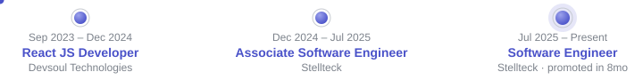

# Muhammad Athar

Software Engineer &mdash; React, Next.js, React Native

I build production web and mobile apps with React, Next.js, and React Native &mdash; from marketplace platforms and fintech UIs to, more recently, AI-integrated interfaces. At Stellteck I ship full-stack features across SaaS, fintech, and nonprofit products; outside of work I build things like a real-estate concierge that can navigate a site for you and an email classifier that's not allowed to fail silently.

## Stack

**Frontend**&nbsp;&nbsp; React&nbsp;&nbsp; Next.js&nbsp;&nbsp; React Native&nbsp;&nbsp; TypeScript&nbsp;&nbsp; Tailwind

**Backend & data**&nbsp;&nbsp; Node.js&nbsp;&nbsp; Express&nbsp;&nbsp; Prisma&nbsp;&nbsp; SQLite

**AI & tooling**&nbsp;&nbsp; Gemini API&nbsp;&nbsp; Zod&nbsp;&nbsp; Playwright&nbsp;&nbsp; Git

## Where the work goes

<table>
<tr>
<td width="160" valign="middle"></td>
<td valign="middle">

🔵 Frontend & UI engineering &mdash; 55%
🟢 State & API integration &mdash; 20%
🟡 AI / LLM integration &mdash; 15%
🔴 Backend & auth &mdash; 10%

</td>
<td width="200" valign="middle"></td>
<td valign="middle">

Capability spread, self-assessed &mdash; not calibrated against any external scale.
Strongest: frontend, state/API integration.
Growing fast: AI/LLM integration.
Testing is the honest growth edge.

</td>
</tr>
</table>

## Experience

## Featured projects

 

### [EstateAI](https://estateai-tau-one.vercel.app/) &nbsp;**LIVE**

Streaming multi-LLM real estate concierge with agentic in-chat navigation and multimodal photo search.

   
&nbsp;&nbsp;[Live](https://estateai-tau-one.vercel.app/) &middot; [Source](https://github.com/Muhammad-Athar/estateai)

 

### [Diamond Loft](https://github.com/Muhammad-Athar/diamond-loft)

Jewellery storefront + admin CMS: realtime order dashboard, PDF receipt generation, Playwright-tested checkout.

  
&nbsp;&nbsp;[Source](https://github.com/Muhammad-Athar/diamond-loft)

 

### [Email Triage Service](https://github.com/Muhammad-Athar/email-triage-service)

Production-safe LLM wrapper: Zod-validated output, automatic retry, guaranteed fallback &mdash; callers never see a broken response, even when the model fails.

  
&nbsp;&nbsp;[Source](https://github.com/Muhammad-Athar/email-triage-service)

---

**Open to full-time roles and freelance projects** &middot; Remote or Lahore, Pakistan
&nbsp;&nbsp;hussanmughal9246@gmail.com &middot; [linkedin.com/in/muhammad-athar-](https://www.linkedin.com/in/muhammad-athar-/)
